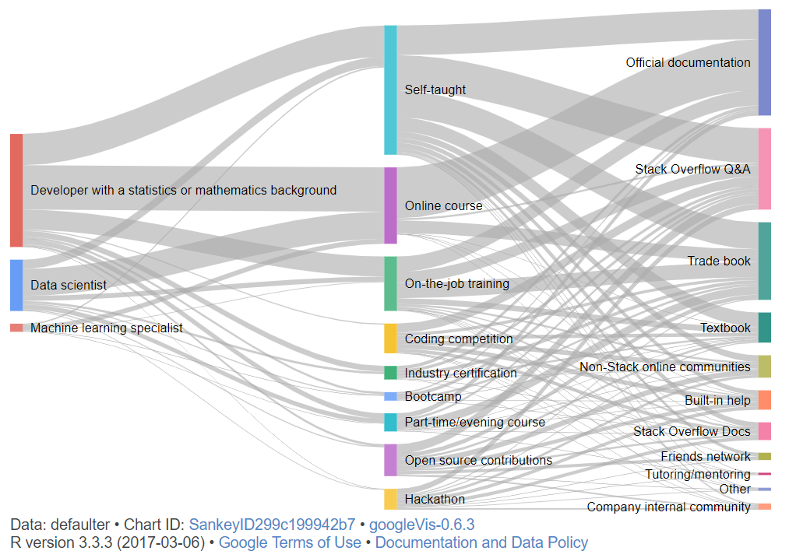

```{r global_options, include=FALSE}
library(knitr)
opts_chunk$set(echo=FALSE, warning=FALSE, message=FALSE)
```

## Student Details

* Rahul Gupta (s3635232)

## Introduction

**Data Scientist: The Sexiest Job of the 21st Century**

In 2012, Harvard Business Review [@HBR] published an article *Data Scientist: The Sexiest Job of the 21st Century*. In the recent years, Machine learning and Artificial Intelligent are in high demand. All the major industries like Facebook, Google, Microsoft, Amazon, LinkedIn, and Twitter are implementing data science into their environment. Data Scientist work includes handling large data sets, clean them and make analysis. They help decision makers from Ad Hoc to ongoing conversation with data. There wasn't much data on this statement, so I analyzed the data from Stack Overflow [@StackOverflow] and Google trends [@GoogleTrends] to look into Data Science.


```{r echo=TRUE}

# Load Libraries
require(ggplot2)
require(dplyr)
require(splitstackshape)
library(googleVis)
library(cowplot)
require(reshape2)
require(lubridate)

# Set Working Directory
setwd("C:/Users/rahul/Google Drive/RMIT/Semester 2/Data Visualization/Assignment 2")

# Read files
Data2017 = read.csv('data/survey_results_public.csv')

# --------------------------
# Mean Salary for Developers
# --------------------------

# Data Cleaning
Salary = Data2017 %>% 
  select(Respondent,Country,DeveloperType,Salary) %>% 
  filter(!is.na(DeveloperType) & !is.na(Salary) & 
           Country %in% c('United States','United Kingdom','Australia'))

Salary_long <- cSplit(Salary, "DeveloperType", sep = ";", direction = "long")

# Create data for Currency Conversion (Average of Jan 2017)
conversionUSD = data.frame(Country = c('United States','United Kingdom','Australia'),
                           exchange = c(1,1.2512,0.7574))

# Merge data
Salary_All = merge(Salary_long,conversionUSD, by ='Country')
Salary_All = Salary_All %>% mutate (SalaryUSD = Salary * exchange)

Salary_Summary = Salary_All %>% 
  group_by(DeveloperType) %>% 
  summarise(count = n(), MeanSalary = mean(SalaryUSD)) %>% 
  filter(DeveloperType != 'Other')

# set the levels 
Salary_Summary$DeveloperType = Salary_Summary$DeveloperType %>% 
  factor(levels = Salary_Summary$DeveloperType[order(Salary_Summary$MeanSalary)]) 

# Adding Color Element
Salary_Summary$colour = ifelse(Salary_Summary$DeveloperType == 'Data scientist' | 
                      Salary_Summary$DeveloperType == 'Machine learning specialist' |
                      Salary_Summary$DeveloperType == 
                        'Developer with a statistics or mathematics background',
                      "positive","negative")

# Plotting
p1 = ggplot(Salary_Summary,aes(DeveloperType,MeanSalary,label="",fill = colour)) + 
  geom_bar(stat='identity',aes(fill = colour)) + 
  scale_fill_manual(values=c(positive="#006699",negative="#008dd3")) +
  coord_flip() +
  guides(fill=FALSE) +
  ggtitle('Average Salary of Software Developer, 2017') +
  xlab('') +
  ylab('Mean Salary in US Dollars') +
  labs(subtitle = 'Salary data of 5244 Responses from US, UK and Australia',
       caption="Source - Stack Overflow Annual Developer Survey, 2017") +
  theme_minimal() +
  theme(plot.caption = element_text(size = 9,color = '#666666',face = "italic"),
        plot.subtitle = element_text(color = '#333333',face = "italic")) 

## ---------------------
## Analysis on Languages
## ---------------------

# Data Cleaning
Languages = Data2017 %>% select(Respondent,Country,HaveWorkedLanguage,DeveloperType) %>% 
  filter(!is.na(HaveWorkedLanguage) & DeveloperType %in% 
           c('Data scientist','Machine learning specialist'))


Languages_long <- cSplit(indt = Languages, 
                         splitCols = c('HaveWorkedLanguage'), 
                         sep = ";", direction = "long")

Languages_summary = Languages_long %>% 
  group_by(HaveWorkedLanguage) %>% 
  summarise(Count = n())

Languages_summary$Percentage = Languages_summary$Count/sum(Languages_summary$Count) * 100

## set levels 
Languages_summary$HaveWorkedLanguage = Languages_summary$HaveWorkedLanguage %>% 
  factor(levels = Languages_summary$HaveWorkedLanguage[order(Languages_summary$Count)]) 

# Filtering the top Ten Languages
Languages_summary = Languages_summary[Languages_summary$Count > 10,]

# Plotting
p2 = ggplot(Languages_summary,aes(HaveWorkedLanguage,Percentage)) + 
  geom_bar(stat='identity', fill="#008dd3") + 
  coord_flip() +
  ggtitle('Top 10 Languages used by Data Scientist, 2017') +
  xlab('') +
  ylab('Percentage') +
  labs(subtitle = '176 Users, Languages worked on, Data scientist and Machine learning specialist',
       caption="Source - Stack Overflow Annual Developer Survey, 2017") +
  theme_minimal() +
  theme(plot.caption = element_text(size = 9,color = '#666666',face = "italic"),
        plot.subtitle = element_text(color = '#333333',face = "italic")) 

##
## Method of Learning
##

# Data Cleaning
Education = Data2017 %>% select(Respondent,EducationTypes,SelfTaughtTypes,DeveloperType) %>% 
  filter(!is.na(EducationTypes) & !is.na(EducationTypes) & DeveloperType %in% 
           c('Data scientist','Machine learning specialist',
             'Developer with a statistics or mathematics background'))

Education_long <- cSplit(indt = Education, 
                         splitCols = c('EducationTypes','SelfTaughtTypes','DeveloperType'), 
                         sep = ";", direction = "long")

x = data.frame(table(Education_long$DeveloperType,Education_long$EducationTypes))
y = data.frame(table(Education_long$EducationTypes,Education_long$SelfTaughtTypes))

defaulter<-rbind(x,y)

# Plotting
sk2 <- gvisSankey(defaulter, from='Var1', to='Var2', weight='Freq',
                  options=list(height=400, width=600))
# plot(sk2)

## ----------------------------------
## Time Series of Growth of Languages
## ----------------------------------

# Read Data
Timeline = read.csv('data/multiTimeline.csv')
Timeline$Week = as.Date(Timeline$Week, "%d-%m-%y")

# Convert to long Format
Timeline.long = melt(Timeline, id.vars = 'Week', 
                     variable.name = 'Languages', value.name = 'Interest')

Timeline.Summary = Timeline.long %>% 
  group_by(Year=floor_date(Week, "year"),Languages) %>%
  summarize(Interest=mean(Interest))

# Plotting
p3 = ggplot(Timeline.Summary,aes(x=Year,y=Interest)) + 
  geom_line(color = "#008dd3") + 
  geom_point(size=2,color = "#008dd3") +
  facet_wrap(~ Languages) + 
  ggtitle('Change in Language Interest Over Time, 2012 - 2017') +
  xlab('') +
  ylab('Interest Over time') +
  labs(subtitle = paste('Python Interest is increasing, R is Stagnant.',
      'However, Java and SQL are shrinking over time'),
       caption="Source - Google Trends in Computers and Electronics, 2017") +
  theme_minimal() +
  theme(axis.text.x = element_text(angle = 45, hjust = 1),
        panel.grid.minor.y = element_blank(),
        panel.grid.minor.x = element_blank(),
        plot.caption = element_text(size = 9,color = '#666666',face = "italic"),
        plot.subtitle = element_text(color = '#333333',face = "italic")) +
  scale_x_date(date_breaks = '1 years',date_labels = '%Y')
```

```{r, fig.height=12, fig.width=7, echo=TRUE}
## Combining all plots
plot_grid(p1, p2, p3,nrow = 3, ncol = 1)
```




## Discussion

Data Scientist, Machine learning specialist and Statistician has the highest Average salary among other developers. The salaries of developers are collected by Stack Overflow Survey. Python, SQL, Java and R is the most used languages by Data Scientist. Based on the languages data, Google trends information is used to get Interest over time between these languages. Python popularity is increasing from 2012, while R is stagnant. However, SQL and Java popularity are declining over the years. 

The Sankey Chart depict the method of learning by Data Scientist. Majority of proportion is dominant by Statistician and Mathematical background, followed by Data Scientist and Machine Learning Specialist. Self-Taught and Online courses are the major source of learning, followed by on job training and open source contribution. In self-taught category, majority of learning is contributed by official document, Stack Overflow and trade book.

# References


